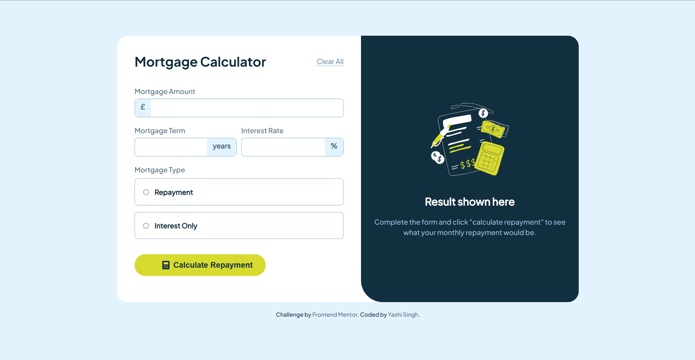
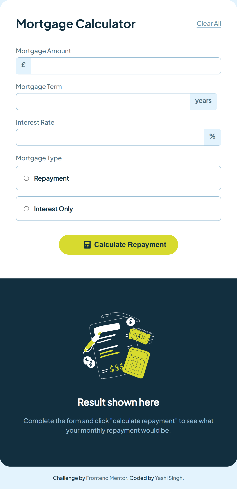

# Frontend Mentor - Mortgage Repayment Calculator Solution

This is a solution to the [Mortgage Repayment Calculator challenge on Frontend Mentor](https://www.frontendmentor.io/challenges/mortgage-repayment-calculator-Galx1LXK73). Frontend Mentor challenges help you improve your coding skills by building realistic projects.

## Table of Contents

- [Overview](#overview)
  - [The challenge](#the-challenge)
  - [Screenshot](#screenshot)
  - [Links](#links)
- [My process](#my-process)
  - [Built with](#built-with)
  - [What I learned](#what-i-learned)
  - [Continued development](#continued-development)
  - [Useful resources](#useful-resources)
  - [Installation](#installation)
- [Author](#author)
- [Acknowledgments](#acknowledgments)

## Overview

### The Challenge

Users should be able to:

- Input mortgage information and see monthly repayment and total repayment amounts after submitting the form
- See form validation messages if any field is incomplete
- Complete the form only using their keyboard
- View the optimal layout for the interface depending on their device's screen size
- See hover and focus states for all interactive elements on the page

### Screenshot

**Desktop Screenshot**



**Mobile Screenshot**



### Links

- Solution URL: [Add solution URL here](https://your-solution-url.com)
- Live Site URL: [Add live site URL here](https://your-live-site-url.com)

## My Process

### Built With

- Semantic HTML5 markup
- LESS (CSS preprocessor)
- Flexbox
- Mobile-first design approach
- Vanilla JavaScript for form validation and calculations
- [VS Code](https://code.visualstudio.com/) for development

### What I Learned

In this project, I learned how to create an interactive and functional mortgage repayment calculator with dynamic form validation. I focused on:

- **Handling form validation**: Ensuring that all required fields (mortgage amount, term, interest rate, and mortgage type) are filled out correctly and providing useful feedback if any of them are missing or invalid.
- **Building a responsive layout**: Making sure the application adjusts well to various screen sizes using a mobile-first design approach with Flexbox and Grid.
- **Using LESS for styles**: I used the LESS preprocessor for styling, which allows me to use variables and mixins to keep the styles clean and maintainable.

Here is an example of how I used LESS:

```less
@red: hsl(4, 69%, 50%);
.error-message {
  color: @red;
}
```

### Continued Development

Going forward, I would like to further improve:

- **Accessibility**: Making sure the calculator is accessible to all users, including those with disabilities.
- **Advanced functionality**: Adding more detailed mortgage options, such as repayment frequency or variable interest rates.
- **Styling**: I plan to explore more advanced styling features in LESS, such as nesting and using functions for dynamic calculations.

### Useful Resources

- [Frontend Mentor - Validation tips](https://www.frontendmentor.io/resources) - This helped me with implementing a form validation system.
- [LESS Documentation](https://lesscss.org/) - The official LESS documentation helped me understand how to structure my stylesheets using the LESS preprocessor.
- [JavaScript Form Validation](https://www.w3schools.com/js/js_validation.asp) - A helpful guide on how to perform client-side form validation.

### Installation

To work with LESS in this project, follow these steps to set up the development environment:

1. **Install Node.js** (if not already installed) from [nodejs.org](https://nodejs.org/). This is required to use npm (Node Package Manager) to install LESS and related dependencies.

2. **Initialize npm** in your project folder:
   Open the terminal (or command prompt) and navigate to your project directory, then run:
   ```bash
   npm init -y
   ```

3. **Install LESS globally or locally**:
   To install LESS globally, use the following command:
   ```bash
   npm install -g less
   ```
   To install LESS locally (specific to the project), run:
   ```bash
   npm install less --save-dev
   ```

4. **Create a LESS file**: 
   - In your project folder, create a `.less` file, e.g., `styles.less`.

5. **Compile LESS into CSS**:
   To compile the LESS file into a `.css` file, run the following command in your terminal:
   ```bash
   lessc styles.less styles.css
   ```

6. **Automate Compilation (optional)**:
   You can use a tool like `watch` to automatically compile LESS when changes are made. To do this, run:
   ```bash
   less-watch-compiler styles.less styles.css
   ```

7. **Link the CSS file** in your HTML:
   Ensure that your HTML links to the compiled CSS file:
   ```html
   <link rel="stylesheet" href="styles.css">
   ```

**Note**: For a smoother experience, you can set up a build tool like **Webpack** or **Gulp** to handle LESS compilation and automate tasks. You can also install tools like **npm scripts** or **gulp-less** to run LESS compilation directly from the command line.

## Author

- LinkedIn - [Yashi Singh](https://www.linkedin.com/in/yashi-singh-b4143a246)
- Frontend Mentor - [@Yashi-Singh-9](https://www.frontendmentor.io/profile/Yashi-Singh-9)

## Acknowledgments

Thanks to the Frontend Mentor community for providing an amazing challenge that helped me practice my skills. Special thanks to the tutorials I referenced to understand form validation and styling using LESS.
